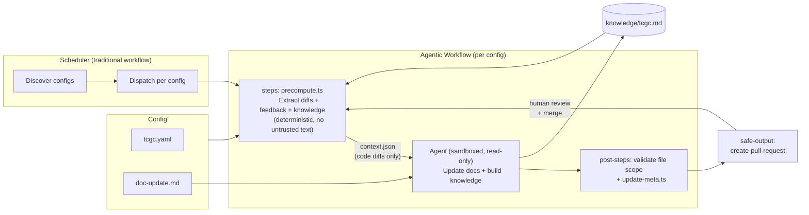

# Doc-Updater Pipeline

## Security Model

- **No untrusted text in agent context**: Review comments and commit messages
  are excluded from `context.json`. Only code diffs are passed to the agent.
- **Agent runs read-only**: File changes are applied only via the
  `create-pull-request` safe output, which sanitizes the output.
- **File scope enforced by post-step**: The `validate file scope` post-step
  checks that the agent only modified files in `allowedPaths` from the config.
- **Network isolation**: The agent runs in a sandboxed container with
  restricted network access.
