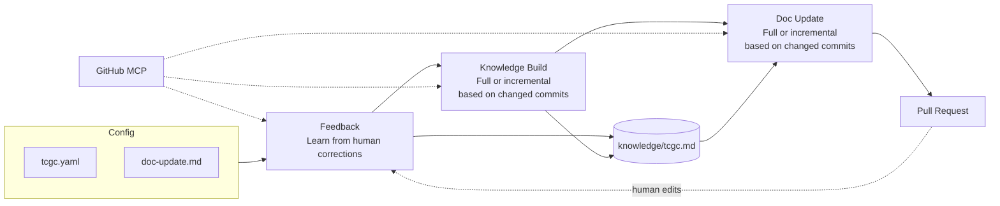

# Doc-Updater Pipeline

```mermaid
flowchart LR
    subgraph Config
        YAML[tcgc.yaml]
        PROMPT[doc-update.md]
    end

    Config --> P0

    P0[Feedback
    Learn from human corrections]
    P1[Knowledge Build
    Full or incremental
    based on changed commits]
    P2[Doc Update
    Full or incremental
    based on changed commits]

    P0 --> P1 --> P2

    KB[(knowledge/tcgc.md)]
    MCP[GitHub MCP]
    PR[Pull Request]

    MCP -.-> P0
    MCP -.-> P1
    MCP -.-> P2
    KB --> P2
    P0 --> KB
    P1 --> KB
    P2 --> PR
    PR -.->|human edits| P0
```
